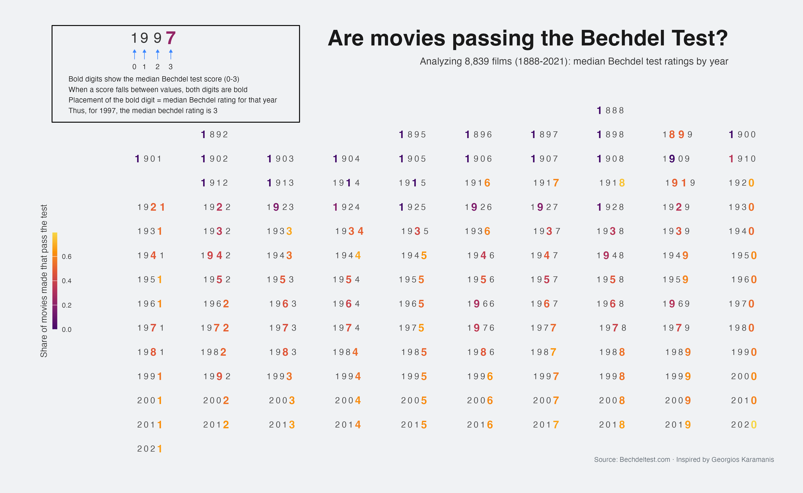

 



## Overview

This repository contains code for a visualization (inspired from Georgios Karamanis) of the Bechdel Test  results across cinema history (1888-2021). 
The visualization encodes median Bechdel scores through digit position and pass rates through color intensity, creating an information-rich display of how female representation in film has evolved over time.

## The Bechdel Test

The Bechdel Test, introduced by cartoonist Alison Bechdel in 1985, evaluates films based on three criteria:
1. The film has at least two named female characters
2. These characters talk to each other
3. Their conversation is about something other than a man

A film scores from 0-3 based on how many criteria it meets.

## About the Visualization

This visualization uses several innovative encoding techniques:
- **Years as data points**: Each year from 1888-2021 is displayed in a grid
- **Bold digit position**: The position of the bold digit in each year (0,1,2,3) indicates that year's median Bechdel score
- **Color intensity**: The color of the bold digit shows the proportion of films that year achieving a perfect score (3)

### How to Read the Visualization
1. Find a year (e.g., "1997")
2. Look for which digit is bold (in 1997, the "7" is bold)
3. The position of that digit (counting from 0) tells you the median score (position 3 = score 3)
4. The color intensity tells you what percentage of films achieved a full pass (brighter = higher percentage)

## Data Source

This visualization uses data from the Bechdel Test Movie List (bechdeltest.com), made available through TidyTuesday (March 9, 2021).

## Code Structure

- `bechdel-exploratory.R`: Initial data exploration and analysis
- `bechdel-visualization.R`: Main visualization code


## Dependencies

- tidyverse
- tidytuesdayR
- colorspace
- ggplot2

## Setup and Execution

```r
# Install required packages
install.packages(c("tidyverse", "tidytuesdayR", "colorspace"))

# Run exploratory analysis
source("bechdel-exploratory.R")

# Generate visualization
source("bechdel-visualization.R")
```
